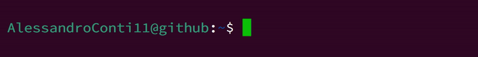

  <h1 align="center"></h1>

<h3 align="center">A passionate backend developer from Italy</h3>

  

- 🎓 Degree: Ing Ind - Inf (1 liv.)(ord. 270) - MI (358) **INGEGNERIA INFORMATICA** at Polytechnic University of Milan
  - Student: Ing Ind - Inf (Mag.)(ord. 270) - MI (481) COMPUTER SCIENCE AND ENGINEERING - INGEGNERIA INFORMATICA at Polytechnic University of Milan

- 🌱 I am interested in **Cyber Security**, **Operating System** and in general all **FOSS**
  
- 👨‍💻 All of my projects are available on my [GitHub page](https://github.com/AlessandroConti11).
- 👨‍💻 My CV is available on my [website](https://alessandroconti11.github.io/cv/).

- 📫 How to reach me **ale.conti.1101@gmail.com** or **alessandro11.conti@mail.polimi.it**

- ⚡ Fun fact **I am an passionate Linux user.
    Linux is incredibly user-friendly, but it has unique preferences when it comes to choosing its friends. This means that if you don't like working on Linux, it may not have chosen you as such yet.**

<h3 align="left">Connect with me:</h3>

  
  
  
  

<h3 align="left">Languages and Tools:</h3>

 
  
   
  
  
  
   

  
  
   

  
   

  
   
   

   
   
  
   
  
   

  
   

  
   

   
  

<h3>Stats: </h3>

<!-- Stats -->
  
<!--Streak -->
<!--    -->
<!-- Language -->
  
<!-- Activity-Graph -->
<!--      -->

###
